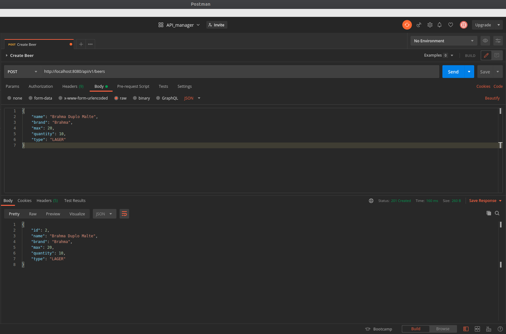

# Beer API Manager
* Foi desenvolvido testes unitários para validar uma API REST de gerenciamento de estoques de cerveja. Foi estruturado com a ajuda de tais frameworks para testes unitários em Java: JUnit, Mockito e Hamcrest. Desafio proposto pelo bootcamp da empresa Everis.
* Validação de funcionalidades básicas: criação, listagem, consulta por nome e exclusão de cervejas.
* TDD: apresentação e exemplo prático em 2 funcionalidades importantes: incremento e decremento do número de cervejas no estoque.

Para executar o projeto no terminal, digite o seguinte comando:

```shell script
mvn spring-boot:run 
```

Para executar a suíte de testes, basta executar o seguinte comando:

```shell script
mvn clean test
```

Após executar o comando ```mvn spring-boot:run```, basta apenas abrir o seguinte endereço e visualizar a execução do projeto:

```
http://localhost:8080/api/v1/beers
```

São necessários os seguintes pré-requisitos para a execução do projeto desenvolvido:

* Java 14 ou versões superiores.
* Maven 3.6.3 ou versões superiores.
* Intellij IDEA Community Edition ou sua IDE favorita.
* Controle de versão GIT instalado na máquina. >Upload na nuvem via github.

Material de apoio:

* [SDKMan! para gerenciamento e instalação do Java e Maven](https://sdkman.io/)
* [Referência do Intellij IDEA Community, para download](https://www.jetbrains.com/idea/download)
* [Palheta de atalhos de comandos do Intellij](https://resources.jetbrains.com/storage/products/intellij-idea/docs/IntelliJIDEA_ReferenceCard.pdf)
* [Site oficial do Spring](https://spring.io/)
* [Site oficial JUnit 5](https://junit.org/junit5/docs/current/user-guide/)
* [Site oficial Mockito](https://site.mockito.org/)
* [Site oficial Hamcrest](https://hamcrest.org/JavaHamcrest/)
* [Referências - testes em geral com o Spring Boot](https://www.baeldung.com/spring-boot-testing)
* [Referência para o padrão arquitetural REST](https://restfulapi.net/)
* [Referência pirâmide de testes - Martin Fowler](https://martinfowler.com/articles/practical-test-pyramid.html#TheImportanceOftestAutomation)
* [Postman - API Development](https://www.postman.com/)
